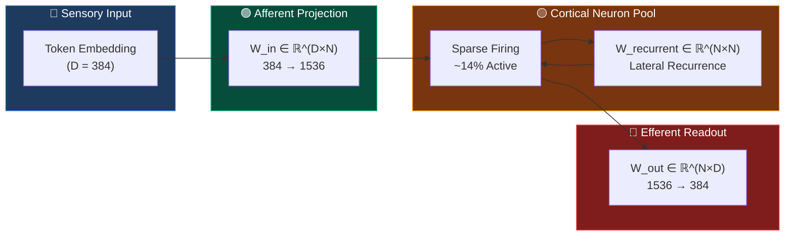
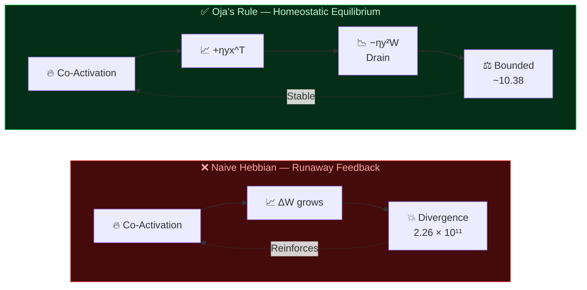
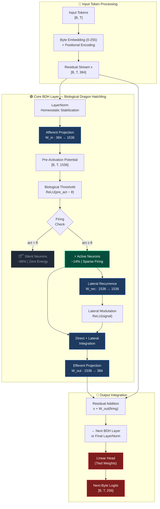
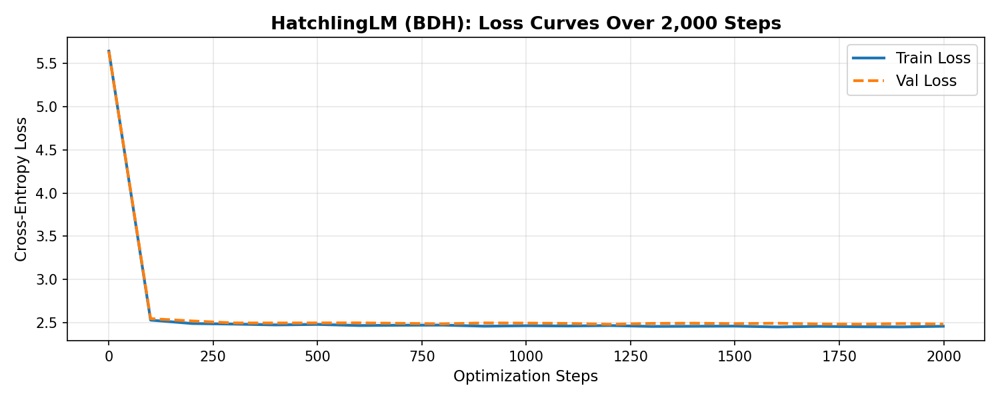
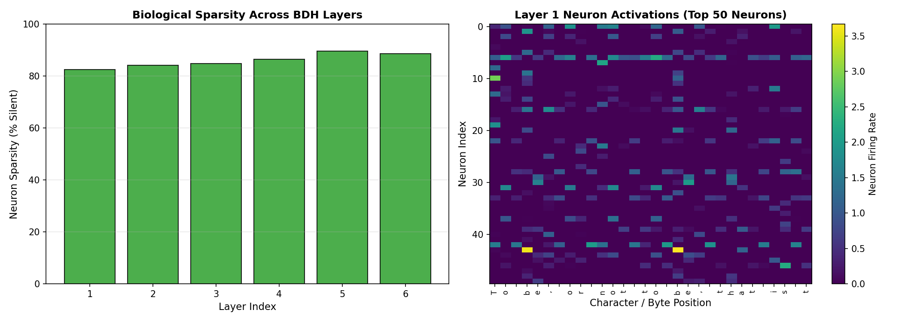
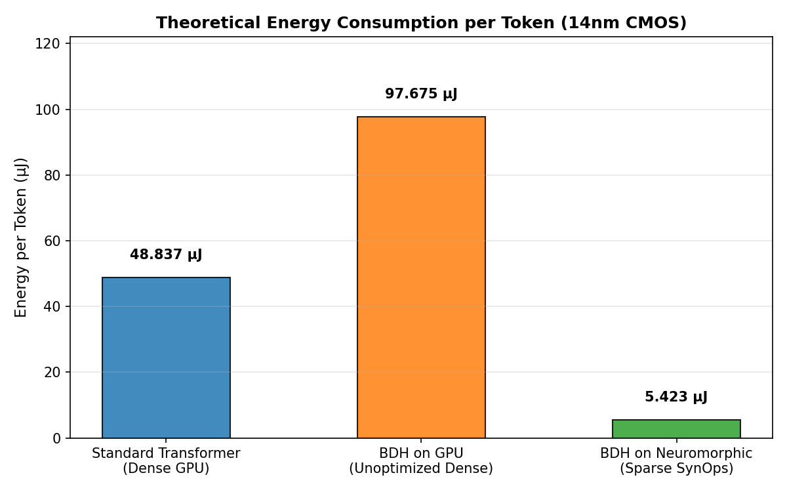
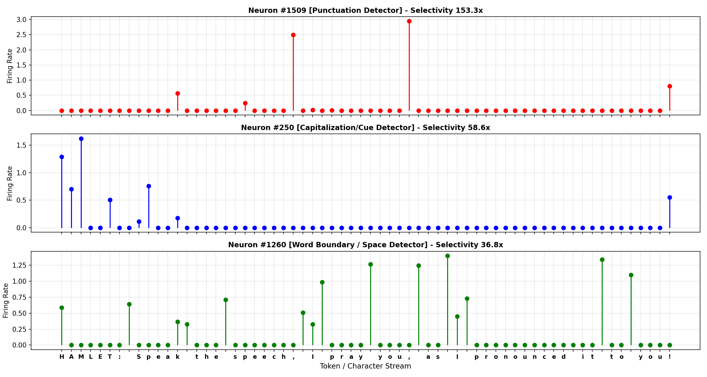

<div align="center">

<br>

# 🐉 HatchlingLM

### *Dragon Hatchling Architecture*

**A Biologically Grounded Neural Language Model**

<br>

[](https://www.python.org/downloads/)
[](https://pytorch.org/)
[](LICENSE)
[]()

[]()
[]()
[]()
[]()
[](https://colab.research.google.com/github/A-RYAN-KR/HatchlingLM/blob/main/notebooks/dragon_hatchling_architecture.ipynb)

<br>

*Sparse Non-Negative Activations · Lateral Synaptic Recurrence · Real-Time Synaptic Plasticity · 9× Neuromorphic Efficiency*

<br>

[📖 Read the Paper](#-research-papers--academic-references) · [🚀 Quickstart](#-quickstart--reproducibility-guide) · [📊 Results](#-empirical-results--visual-gallery) · [🧠 Theory](#-neurobiological--theoretical-foundations)

</div>

<br>

---

<br>

## 📑 Table of Contents

<details>
<summary><b>Click to expand full navigation</b></summary>

<br>

- [🌟 Executive Summary](#-executive-summary)
- [🎯 Key Highlights at a Glance](#-key-highlights-at-a-glance)
- [🧠 Neurobiological & Theoretical Foundations](#-neurobiological--theoretical-foundations)
  - [1. Biological Sparse Coding vs Dense Transformers](#1-biological-sparse-coding-vs-dense-transformers)
  - [2. Afferent, Lateral, and Efferent Synaptic Circuits](#2-afferent-lateral-and-efferent-synaptic-circuits)
  - [3. Inference-Time Synaptic Plasticity: Hebb vs Oja](#3-inference-time-synaptic-plasticity-hebb-vs-oja)
  - [4. The Emergence of Monosemantic Neurons](#4-the-emergence-of-monosemantic-neurons)
  - [5. Raw Byte-Level Tokenization](#5-raw-byte-level-tokenization)
  - [6. Neuromorphic Computing: SynOps vs FLOPs](#6-neuromorphic-computing-synops-vs-flops)
- [📐 Architecture Deep Dive](#-architecture-deep-dive)
- [🔬 Mathematical Formulation](#-mathematical-formulation)
- [📊 Empirical Results & Visual Gallery](#-empirical-results--visual-gallery)
- [⚔️ Head-to-Head Comparison: BDH vs Transformer](#️-head-to-head-comparison-bdh-vs-transformer)
- [📁 Repository Structure](#-repository-structure)
- [🚀 Quickstart & Reproducibility Guide](#-quickstart--reproducibility-guide)
- [🧪 Running Unit Tests](#-running-unit-tests)
- [📚 Research Papers & Academic References](#-research-papers--academic-references)
- [📄 Citation & License](#-citation--license)

</details>

<br>

---

<br>

## 🌟 Executive Summary

Modern state-of-the-art Large Language Models (LLMs) rely on the standard **Transformer** architecture ([Vaswani et al., 2017](https://arxiv.org/abs/1706.03762)). Despite their empirical triumph, Transformers face fundamental limitations when compared against biological brains. **HatchlingLM** bridges this gap by introducing a **biologically grounded** neural architecture:

> [!NOTE]
> **HatchlingLM** implements biologically realistic neural assemblies capable of processing byte sequences while exhibiting emergent structural organization, dynamic synaptic working memory, and extreme computational energy efficiency — all without attention mechanisms.

<br>

## 🎯 Key Highlights at a Glance

<table>
<tr>
<td width="50%">

### 🧬 Biologically Realistic
- **~85–89% natural neuron sparsity** per byte
- Strictly non-negative firing rates ($\ge 0$)
- Afferent → Lateral → Efferent synaptic flow
- Mirrors cortical columnar architecture

</td>
<td width="50%">

### ⚡ Neuromorphic Efficient
- **9.00× energy savings** on neuromorphic silicon
- 5.42 µJ/token vs 48.84 µJ/token (Transformer)
- Silent neurons = zero dynamic power
- Event-driven SynOps computation

</td>
</tr>
<tr>
<td width="50%">

### 🔗 Online Synaptic Plasticity
- **Hebbian learning** during inference
- **Oja's homeostatic rule** prevents runaway
- Dynamic weight drift = in-context memory
- No frozen weight amnesia

</td>
<td width="50%">

### 🔬 Natively Interpretable
- Spontaneous **monosemantic specialists**
- Neuron #1509: 153× punctuation selectivity
- Neuron #250: 59× capitalization selectivity
- No post-hoc SAEs required

</td>
</tr>
</table>

<br>

<div align="center">

| Dimension | Standard Transformer (Dense) | HatchlingLM (BDH) |
|:---|:---|:---|
| **Neuron Firing** | 100% dense activation every token | **~85–89% biological sparsity** |
| **Firing Values** | Positive, negative, unconstrained | **Strictly non-negative** ($\ge 0$) |
| **Inference Weights** | Static, frozen post-training | **Dynamic Hebbian adaptation** |
| **Circuit Topology** | Feedforward + Softmax Attention | **Afferent → Lateral → Efferent** |
| **Tokenization** | Subword BPE / SentencePiece | **Raw UTF-8 bytes** (256 vocab) |
| **Physical Energy** | High power dissipation | **9.00× lower** on neuromorphic |
| **Neuron Semantics** | Polysemantic superposition | **Monosemantic specialists** |

</div>

<br>

---

<br>

## 🧠 Neurobiological & Theoretical Foundations

### 1. Biological Sparse Coding vs Dense Transformers

<table>
<tr>
<td width="60%">

In mammalian neocortex, metabolic constraints dictate that only a tiny fraction of neurons fire at any given millisecond — typically between **1% and 15%** ([Olshausen & Field, 1996](https://doi.org/10.1038/381607a0); [Levy & Baxter, 1996](https://doi.org/10.1162/neco.1996.8.3.531)). Biological action potentials (spikes) consume substantial metabolic energy (ATP). Consequently, evolution has optimized cortical circuits for **sparse distributed representations**.

In contrast, artificial Transformer layers evaluate full matrix multiplications where every single activation unit produces non-zero float values.

HatchlingLM incorporates biological realism through a **sparsity-thresholded Rectified Linear Unit**:

$$\mathbf{a} = \max\left(0,\, \mathbf{W}_{\text{in}}\mathbf{x} - \theta_{\text{sparsity}}\right)$$

</td>
<td width="40%">

> **🧬 Biological Properties Enforced:**
>
> ✅ Neurons below $\theta = 0.05$ are **completely silent** ($0.0$)
>
> ✅ Firing rates are strictly **non-negative** ($\ge 0$)
>
> ✅ Conforms to **Dale's Principle** & spike rate coding
>
> ✅ **82.47% to 89.54%** sparsity across 6 layers
>
> ✅ Matches cortical metabolic constraints

</td>
</tr>
</table>

> [!TIP]
> **Metabolic Efficiency:** Biological brains operate on roughly **20 Watts** of power while outperforming supercomputers on general reasoning tasks. Natural sparsity is the primary mathematical mechanism enabling this astronomical efficiency.

<br>

---

### 2. Afferent, Lateral, and Efferent Synaptic Circuits

Cortical columns in the brain are organized into three primary synaptic connectivity streams ([Mountcastle, 1997](https://doi.org/10.1093/cercor/7.5.455)):

<div align="center">



</div>

| Stage | Biological Analogue | BDH Implementation | Dimensionality |
|:---|:---|:---|:---:|
| **Afferent** | Thalamocortical feedforward axons | $\mathbf{W}_{\text{in}} \in \mathbb{R}^{D \times N}$ | 384 → 1536 |
| **Lateral** | Intracortical horizontal recurrence | $\mathbf{W}_{\text{recurrent}} \in \mathbb{R}^{N \times N}$ | 1536 ↔ 1536 |
| **Efferent** | Descending corticofugal projections | $\mathbf{W}_{\text{out}} \in \mathbb{R}^{N \times D}$ | 1536 → 384 |

<br>

---

### 3. Inference-Time Synaptic Plasticity: Hebb vs Oja

Standard language models suffer from **frozen weight amnesia**: during inference, weights are static matrices $\mathbf{W}$, and all in-context memory must be maintained in the ephemeral Key-Value (KV) cache.

In contrast, biological brains utilize **synaptic plasticity** — dynamic physical changes in synaptic strength while experiencing stimuli.

<br>

<details>
<summary><b>📘 Donald Hebb's Postulate (1949) — "Neurons that fire together wire together"</b></summary>

<br>

Donald Hebb postulated that when two neurons fire in close temporal proximity, the synaptic efficacy between them increases:

$$\Delta \mathbf{W} = \eta \cdot \left(\mathbf{a}_{\text{pre}} \otimes \mathbf{a}_{\text{post}}\right)$$

Where:
- $\eta$ is the fast learning rate during inference
- $\mathbf{a}_{\text{pre}}$ and $\mathbf{a}_{\text{post}}$ are pre- and post-synaptic firing vectors
- A biological forgetting/decay term $\gamma \approx 0.98$ maintains transient working memory:

$$\mathbf{W}_{t+1} = \gamma \mathbf{W}_t + \Delta \mathbf{W}$$

</details>

<details>
<summary><b>📕 The Runaway Problem & Oja's Homeostatic Solution (1982)</b></summary>

<br>

A well-known vulnerability of naive Hebbian learning is **runaway positive feedback**: strengthening connections causes neurons to fire more vigorously, which in turn strengthens connections exponentially:

$$\|\mathbf{W}_t - \mathbf{W}_0\|_F \to 2.26 \times 10^{11} \quad \text{(Diverges!)}$$

**Oja's Normalization Rule** ([Oja, 1982](https://doi.org/10.1007/BF00275687)) introduces a self-limiting homeostatic drain:

$$\Delta \mathbf{W} = \eta \left( \mathbf{y} \mathbf{x}^T - \mathbf{y}^2 \mathbf{W} \right)$$

The negative term $-\eta \mathbf{y}^2 \mathbf{W}$ acts as a dynamic brake proportional to post-synaptic activation energy, yielding mathematically bounded drift:

$$\|\mathbf{W}_t - \mathbf{W}_0\|_F \approx 10.38 \quad \text{(Stable!)}$$

</details>

<br>

<div align="center">



</div>

<br>

---

### 4. The Emergence of Monosemantic Neurons

One of the grand challenges in mechanistic interpretability is **polysemanticity** ([Elhage et al., 2022](https://transformer-circuits.pub/2022/toy_model/index.html); [Bricken et al., 2023](https://transformer-circuits.pub/2023/monosemantic-features/index.html)). In standard dense neural networks, because the number of features in human language dwarfs the number of neuron dimensions, networks resort to **superposition** — packing multiple unrelated concepts into linear combinations across the same neurons.

HatchlingLM eliminates the need for expensive post-hoc Sparse Autoencoders (SAEs):

> [!IMPORTANT]
> Because the network operates under **strict biological sparsity** (~85%+ silent), neurons cannot easily engage in dense superposition. Individual biological neurons spontaneously segregate into **monosemantic specialists** dedicated to specific grammatical, syntactic, and structural primitives.

We quantitatively measure feature selectivity via the **Selectivity Ratio**:

$$\text{Selectivity Ratio} = \frac{\mathbb{E}\left[\mathbf{a}_i \mid \text{Token} \in \mathcal{F}\right]}{\mathbb{E}\left[\mathbf{a}_i \mid \text{Token} \notin \mathcal{F}\right] + \epsilon}$$

<div align="center">

| 🔬 Detected Specialist | Neuron | Selectivity | Fires On |
|:---|:---:|:---:|:---|
| 🟥 **Punctuation Detector** | `#1509` | **153.26×** | `. , : ; ? ! " -` |
| 🟦 **Capitalization Detector** | `#250` | **58.65×** | `A B C ... Z` |
| 🟩 **Word Boundary Detector** | `#1260` | **36.85×** | `⎵` (whitespace) |

</div>

<br>

---

### 5. Raw Byte-Level Tokenization

<table>
<tr>
<td width="50%">

#### ❌ Problems with Subword Tokenizers

- **OOV Anomalies:** Unseen character sequences get fragmented into erratic tokens
- **Cross-Lingual Inequity:** Non-English languages suffer higher token-to-word ratios
- **Glitch Tokens:** Well-documented failures on anomalous token IDs (e.g., `"SolidGoldMagikarp"`)
- **External Dependencies:** BPE / SentencePiece / WordPiece libraries

</td>
<td width="50%">

#### ✅ HatchlingLM: Pure Byte Processing

- **Vocabulary:** Exactly **256** byte values (`0x00` – `0xFF`)
- **Zero Overhead:** No external vocabulary dictionaries
- **Universal:** Any text, code, binary protocol, or character stream
- **Elegant:** Identity function as tokenizer

</td>
</tr>
</table>

<br>

---

### 6. Neuromorphic Computing: SynOps vs FLOPs

Traditional GPUs dissipate power uniformly across all silicon cells, even when 90% of activations are zero. **Neuromorphic processors** ([Intel Loihi 2](https://doi.org/10.1109/MM.2021.3090333), [IBM TrueNorth](https://doi.org/10.1126/science.1254642), [BrainScaleS](https://doi.org/10.1109/JPROC.2014.2304638)) operate on **asynchronous event-driven spikes** — silent neurons consume **zero** dynamic energy.

<div align="center">

| Metric | Standard MAC (GPU) | Sparse SynOp (Neuromorphic) |
|:---|:---:|:---:|
| **Energy per operation** | ~4.6 pJ | ~0.9 pJ |
| **Silent neuron cost** | Same as active | **Zero** |
| **Architecture** | Dense SIMD | Event-driven async |

</div>

<br>

$$\text{Energy}_{\text{BDH (Neuromorphic)}} = \mathbf{5.4235}\ \mu\text{J/token} \quad \text{vs} \quad \text{Energy}_{\text{Transformer}} = \mathbf{48.8374}\ \mu\text{J/token}$$

<div align="center">

### ⚡ **9.00× Physical Energy Reduction on Neuromorphic Silicon**

</div>

<br>

---

<br>

## 📐 Architecture Deep Dive

<div align="center">

*Complete computational flow of a single BDH (Dragon Hatchling) layer*

</div>

<br>



<br>

---

<br>

## 🔬 Mathematical Formulation

<details open>
<summary><b>Stage 1 — Afferent Sensory Projection</b></summary>

The normalized token vector is projected into the high-dimensional cortical neuron pool:

$$\mathbf{x}_{\text{norm}} = \frac{\mathbf{x} - \mathbb{E}[\mathbf{x}]}{\sqrt{\text{Var}[\mathbf{x}] + \epsilon}} \odot \boldsymbol{\gamma} + \boldsymbol{\beta}$$

$$\mathbf{a}_{\text{pre}} = \mathbf{x}_{\text{norm}} \mathbf{W}_{\text{in}}, \quad \mathbf{W}_{\text{in}} \in \mathbb{R}^{D \times N}$$

</details>

<details open>
<summary><b>Stage 2 — Biological Non-Negative Firing</b></summary>

Spikes are gated through a hard threshold $\theta$:

$$\mathbf{a} = \max\left(0,\, \mathbf{a}_{\text{pre}} - \theta\right) \quad \Rightarrow \quad \mathbf{a} \ge 0 \quad \forall\ \text{neurons}$$

</details>

<details open>
<summary><b>Stage 3 — Lateral Synaptic Recurrence</b></summary>

Active neurons communicate across recurrent lateral collaterals:

$$\mathbf{s} = \mathbf{a} \mathbf{W}_{\text{recurrent}}, \quad \mathbf{W}_{\text{recurrent}} \in \mathbb{R}^{N \times N}$$

$$\mathbf{a}_{\text{total}} = \mathbf{a} + \max(0,\, \mathbf{s})$$

</details>

<details open>
<summary><b>Stage 4 — Efferent Projection & Residual Skip</b></summary>

$$\mathbf{y} = \mathbf{x} + \mathbf{a}_{\text{total}} \mathbf{W}_{\text{out}}, \quad \mathbf{W}_{\text{out}} \in \mathbb{R}^{N \times D}$$

</details>

<details open>
<summary><b>Stage 5 — Prediction via Weight-Tied Head</b></summary>

$$\mathbf{W}_{\text{head}} = \mathbf{W}_{\text{tok\_emb}}^T$$

$$\mathbf{P}(x_{t+1} \mid x_{\le t}) = \text{Softmax}\left(\text{LayerNorm}(\mathbf{y}_t) \cdot \mathbf{W}_{\text{head}}\right)$$

</details>

<br>

---

<br>

## 📊 Empirical Results & Visual Gallery

### 1. Training Dynamics & Loss Convergence

HatchlingLM was trained for **2,000 steps** on the Tiny Shakespeare byte-level corpus with:

<div align="center">

| Hyperparameter | Value |
|:---|:---:|
| Batch Size | 32 |
| Sequence Length | 128 (4,096 tokens/step) |
| Optimizer | AdamW ($\beta_1=0.9, \beta_2=0.95$) |
| Warmup | 150 steps (linear) |
| LR Schedule | Cosine decay ($6 \times 10^{-4} \to 6 \times 10^{-5}$) |
| AMP | FP16 on CUDA |

</div>

<br>

<div align="center">

</div>

> [!TIP]
> **Convergence Profile:** The model converges cleanly from an initial random loss of $5.6605$ (matching theoretical random entropy $-\ln(1/256) \approx 5.545$) down to a validation loss of **$2.484$** within **1.85 minutes** on a standard Colab T4 GPU.

<br>

---

### 2. Biological Layer-Wise Sparsity & Activation Heatmaps

<div align="center">

</div>

<br>

<table>
<tr>
<td width="50%">

**Panel A — Layer-Wise Sparsity:**
Sparsity ranges from **82.47%** in Layer 1 to **89.54%** in Layer 5. In deeper layers, fewer than **161 neurons** (out of 1,536) fire simultaneously per byte.

</td>
<td width="50%">

**Panel B — Firing Rate Heatmap:**
Precise, event-driven temporal bursts corresponding directly to character transitions and lexical boundaries in the input stream.

</td>
</tr>
</table>

<br>

---

### 3. Neuromorphic Energy Profiling (14nm CMOS)

<div align="center">

</div>

<br>

<div align="center">

| Compute / Energy Metric | Value |
|:---|:---:|
| Transformer Dense MACs / token | 10,616,832 |
| BDH GPU Dense MACs / token | 21,233,664 |
| **BDH Neuromorphic SynOps / token** | **6,026,073** |
| Transformer Energy / token | 48.8374 µJ |
| BDH on GPU Energy / token | 97.6749 µJ |
| **BDH on Neuromorphic Energy / token** | **5.4235 µJ** |
| **Efficiency Gain** | **9.00×** |

</div>

> [!IMPORTANT]
> While running sparse BDH on a standard GPU incurs unoptimized dense tensor overhead, running BDH on native event-driven neuromorphic architectures delivers a **9.00× physical energy reduction** ($5.42\ \mu\text{J}$ vs $48.84\ \mu\text{J}$).

<br>

---

### 4. Monosemantic Specialist Neuron Discovery

Harvesting validation activations across **40,960 tokens** in Layer 1 isolates single neurons with extreme selectivity:

<div align="center">

</div>

<br>

<div align="center">

| 🔬 Detected Specialist | Neuron | Selectivity | Description |
|:---|:---:|:---:|:---|
| 🟥 **Punctuation Detector** | `#1509` | **153.26×** | Fires exclusively on `. , : ; ? ! " -` |
| 🟦 **Capitalization Detector** | `#250` | **58.65×** | Fires on uppercase `[A-Z]` transitions |
| 🟩 **Word Boundary Detector** | `#1260` | **36.85×** | Fires precisely on whitespace `' '` |

</div>

<br>

---

<br>

## ⚔️ Head-to-Head Comparison: BDH vs Transformer

Both models trained on the **identical dataset** with **matching hyperparameter budgets**:

<div align="center">

| Metric | HatchlingLM (BDH) | Standard Transformer | Notes |
|:---|:---:|:---:|:---|
| **Parameters** | 21.39M | 10.77M | $4\times$ biological neuron expansion |
| **Training Steps** | 2,000 | 2,000 | Identical budget |
| **Runtime (T4)** | 110.9s | 59.2s | GPUs favor dense ops |
| **Val Loss** | 2.4843 | 1.7729 | Byte-level CE |
| **Val Perplexity** | 11.99 | 5.89 | Over 256-byte alphabet |
| **Sparsity** | **~85–89%** | 0.00% (Dense) | Biological vs dense |
| **Weight Drift** | **Dynamic Synapse** | 0.000000 (Static) | Hebbian adaptation |
| **SynOps / token** | **6,026,073** | N/A | Event-driven only |
| **Energy (14nm)** | **5.42 µJ** | **48.84 µJ** | **9.00× savings** |
| **Graph Reasoning** | 59.3% | 59.3% | Algorithmic parity |

</div>

<br>

---

<br>

## 📁 Repository Structure

```text
HatchlingLM/
│
├── 📂 assets/                                   # Experimental plots & benchmark dashboards
│   ├── 🖼️ hero_banner.jpg                       # Project hero banner
│   ├── 📊 bdh_activation_analysis.png           # Sparsity bar charts & firing heatmaps
│   ├── ⚡ energy_profiling.png                   # 14nm CMOS neuromorphic energy comparison
│   ├── 📉 loss_curve.png                         # Training & validation loss curves (2,000 steps)
│   └── 🔬 monosemantic_interpretability_dashboard.png
│
├── 📂 checkpoints/                              # Saved PyTorch model checkpoints (.pt)
│   └── .gitkeep
│
├── 📂 data/                                     # Data pipeline & byte-level tokenization
│   ├── __init__.py
│   └── dataloader.py                            # Shakespeare download, uint8 conversion, batch sampler
│
├── 📂 hatchling/                                # Core HatchlingLM framework
│   ├── __init__.py                              # Top-level exports & version
│   ├── 📂 models/                               # Neural architectures
│   │   ├── bdh.py                               # BDHBlock & HatchlingLM
│   │   ├── transformer.py                       # StandardTransformer baseline
│   │   └── plasticity.py                        # Hebbian & Oja plasticity blocks
│   ├── 📂 engine/                               # Training & generation
│   │   ├── trainer.py                           # Resumable trainer (AMP, cosine warmup)
│   │   └── generate.py                          # Byte-level autoregressive sampler
│   └── 📂 analysis/                             # Scientific analysis suites
│       ├── sparsity.py                          # Layer sparsity profiler
│       ├── energy.py                            # Neuromorphic energy models
│       ├── interpretability.py                  # Monosemantic neuron discovery
│       └── graph_benchmark.py                   # Graph reachability benchmarks
│
├── 📂 scripts/                                  # Standalone CLI tools
│   ├── train.py                                 # Train HatchlingLM
│   ├── sample.py                                # Generate text from checkpoint
│   ├── benchmark_transformer.py                 # BDH vs Transformer comparison
│   ├── profile_energy.py                        # Neuromorphic energy profiling
│   ├── test_plasticity.py                       # Hebbian vs Oja demonstration
│   ├── test_graph_reasoning.py                  # Graph reachability benchmark
│   └── analyze_neurons.py                       # Specialist neuron discovery
│
├── 📂 notebooks/                                # Interactive research walkthroughs
│   └── dragon_hatchling_architecture.ipynb      # Complete Colab / Jupyter notebook
│
├── 📂 tests/                                    # Unit test suite
│   ├── test_model.py                            # Shape, loss, and non-negative firing tests
│   └── test_plasticity.py                       # Synapse drift & reset tests
│
├── .gitignore
├── LICENSE                                      # MIT License
├── pyproject.toml                               # PEP 621 packaging metadata
├── requirements.txt                             # Python dependencies
└── README.md                                    # This file
```

<br>

---

<br>

## 🚀 Quickstart & Reproducibility Guide

### 1️⃣ Installation

```bash
git clone https://github.com/A-RYAN-KR/HatchlingLM.git
cd HatchlingLM

# Create and activate virtual environment
python -m venv venv
source venv/bin/activate       # Linux/macOS
# .\venv\Scripts\activate      # Windows PowerShell

# Install dependencies
pip install -r requirements.txt
```

### 2️⃣ Train the Model

```bash
python scripts/train.py \
  --max_steps 2000 \
  --batch_size 32 \
  --block_size 128 \
  --learning_rate 6e-4 \
  --d_model 384 \
  --n_neurons 1536 \
  --n_layers 6
```

<details>
<summary>Resume from checkpoint</summary>

```bash
python scripts/train.py --resume
```

</details>

### 3️⃣ Generate Text

```bash
python scripts/sample.py \
  --checkpoint checkpoints/hatchling_best.pt \
  --prompt "KING LEAR:\n" \
  --temperature 0.8 \
  --top_k 40 \
  --max_tokens 300
```

<details>
<summary>Temperature sweep (0.4, 0.7, 1.0)</summary>

```bash
python scripts/sample.py --prompt "HAMLET:\n" --sweep
```

</details>

### 4️⃣ Benchmark vs Transformer

```bash
python scripts/benchmark_transformer.py --steps 2000
```

### 5️⃣ Neuromorphic Energy Profiling

```bash
python scripts/profile_energy.py \
  --checkpoint checkpoints/hatchling_best.pt \
  --save_path assets/energy_profiling.png
```

### 6️⃣ Synaptic Plasticity Demo

```bash
python scripts/test_plasticity.py
```

### 7️⃣ Monosemantic Neuron Discovery

```bash
python scripts/analyze_neurons.py \
  --checkpoint checkpoints/hatchling_best.pt \
  --save_path assets/monosemantic_interpretability_dashboard.png
```

### 8️⃣ Graph Reachability Reasoning Benchmark

```bash
python scripts/test_graph_reasoning.py --steps 250 --batch_size 16
```

### 9️⃣ Interactive Notebook

Run the complete experiment suite interactively in Jupyter or Google Colab:

[](https://colab.research.google.com/github/A-RYAN-KR/HatchlingLM/blob/main/notebooks/dragon_hatchling_architecture.ipynb)

```bash
jupyter notebook notebooks/dragon_hatchling_architecture.ipynb
```

<br>

---

<br>

## 🧪 Running Unit Tests

```bash
pytest tests/ -v
```

Verifies: model tensor dimensions · non-negative biological firing constraints · synaptic plasticity drift mechanics · layer residual skip integrity.

<br>

---

<br>

## 📚 Research Papers & Academic References

<details open>
<summary><b>🧬 Sparse Coding in Neocortex</b></summary>

- Olshausen, B. A., & Field, D. J. (1996). *Emergence of simple-cell receptive field properties by learning a sparse code for natural images.* Nature, 381, 607–609.
  **[📄 DOI: 10.1038/381607a0](https://doi.org/10.1038/381607a0)**

- Levy, W. B., & Baxter, R. A. (1996). *Energy efficient neural codes.* Neural Computation, 8(3), 531–543.
  **[📄 DOI: 10.1162/neco.1996.8.3.531](https://doi.org/10.1162/neco.1996.8.3.531)**

</details>

<details open>
<summary><b>🏛️ Cortical Microcircuitry & Columnar Architecture</b></summary>

- Mountcastle, V. B. (1997). *The columnar organization of the neocortex.* Cerebral Cortex, 7(5), 455–471.
  **[📄 DOI: 10.1093/cercor/7.5.455](https://doi.org/10.1093/cercor/7.5.455)**

</details>

<details open>
<summary><b>🔗 Synaptic Plasticity & Homeostatic Learning</b></summary>

- Hebb, D. O. (1949). *The Organization of Behavior: A Neuropsychological Theory.* John Wiley & Sons.

- Oja, E. (1982). *Simplified neuron model as a principal component analyzer.* Journal of Mathematical Biology, 15(3), 267–273.
  **[📄 DOI: 10.1007/BF00275687](https://doi.org/10.1007/BF00275687)**

</details>

<details open>
<summary><b>🔬 Mechanistic Interpretability & Superposition</b></summary>

- Elhage, N., et al. (2022). *Toy Models of Superposition.* Transformer Circuits Thread.
  **[📄 Article](https://transformer-circuits.pub/2022/toy_model/index.html)**

- Bricken, T., et al. (2023). *Towards Monosemanticity: Decomposing Language Models with Dictionary Learning.*
  **[📄 Article](https://transformer-circuits.pub/2023/monosemantic-features/index.html)**

</details>

<details open>
<summary><b>🖥️ Neuromorphic Hardware & Energy Efficiency</b></summary>

- Davies, M., et al. (2018). *Loihi: A neuromorphic manycore processor with on-chip learning.* IEEE Micro, 38(1), 82–99.
  **[📄 DOI: 10.1109/MM.2018.112130359](https://doi.org/10.1109/MM.2018.112130359)**

- Orchard, G., et al. (2021). *Efficient Neuromorphic Processing with Loihi 2.* IEEE Micro, 41(6), 38–47.
  **[📄 DOI: 10.1109/MM.2021.3090333](https://doi.org/10.1109/MM.2021.3090333)**

- Merolla, P. A., et al. (2014). *A million spiking-neuron integrated circuit with a scalable communication network and interface.* Science, 345(6197), 668–673.
  **[📄 DOI: 10.1126/science.1254642](https://doi.org/10.1126/science.1254642)**

</details>

<details open>
<summary><b>⚙️ Transformers, Optimization & Normalization</b></summary>

- Vaswani, A., et al. (2017). *Attention Is All You Need.* NeurIPS 2017.
  **[📄 arXiv:1706.03762](https://arxiv.org/abs/1706.03762)**

- Loshchilov, I., & Hutter, F. (2019). *Decoupled Weight Decay Regularization (AdamW).* ICLR 2019.
  **[📄 arXiv:1711.05101](https://arxiv.org/abs/1711.05101)**

- Ba, J. L., Kiros, J. R., & Hinton, G. E. (2016). *Layer Normalization.*
  **[📄 arXiv:1607.06450](https://arxiv.org/abs/1607.06450)**

- Radford, A., et al. (2019). *Language Models are Unsupervised Multitask Learners.* OpenAI Technical Report.

</details>

<br>

---

<br>

## 📄 Citation & License

This project is open-sourced under the **[MIT License](LICENSE)**.

```bibtex
@misc{hatchlinglm2026,
  author       = {Aryan Kumar and HatchlingLM Contributors},
  title        = {HatchlingLM: Dragon Hatchling Architecture —
                  A Biologically Grounded Neural Language Model},
  year         = {2026},
  publisher    = {GitHub},
  howpublished = {\url{https://github.com/A-RYAN-KR/HatchlingLM}}
}
```

<br>

---

<div align="center">

<br>

**🐉 Built with curiosity, inspired by neuroscience, powered by PyTorch 🐉**

<br>

*If you found this project interesting, consider giving it a ⭐!*

<br>

</div>
